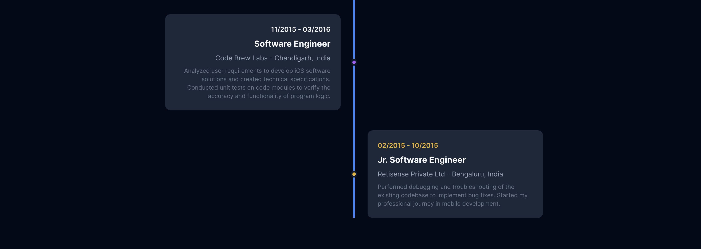

# Suhail Shabir Portfolio - Flutter Web

A professional portfolio website built with Flutter Web, showcasing mobile development expertise and projects.

Welcome to my project! Here's a quick look:





## Features

- **Responsive Design**: Optimized for both desktop and mobile devices
- **Clean Architecture**: Organized with domain-driven design principles
- **BLoC State Management**: Efficient state management using flutter_bloc
- **Multilingual Support**: Built-in internationalization support
- **Smooth Animations**: Engaging user experience with staggered animations
- **Modern UI**: Contemporary design with dark theme
- **Contact Form**: Functional contact form with validation
- **SEO Optimized**: Proper meta tags and structure for search engines

## Tech Stack

- **Framework**: Flutter 3.0+
- **State Management**: BLoC Pattern
- **Architecture**: Clean Architecture
- **Dependency Injection**: GetIt
- **Internationalization**: Flutter Intl
- **Responsive Design**: Responsive Builder & ScreenUtil
- **Animations**: Staggered Animations & Animated Text Kit
- **Typography**: Google Fonts (Inter)
- **Icons**: Font Awesome Flutter

## Project Structure

```
lib/
├── core/
│   ├── di/                 # Dependency Injection
│   └── router/             # App Routing
├── features/
│   └── portfolio/
│       ├── data/
│       │   ├── datasources/
│       │   └── repositories/
│       ├── domain/
│       │   ├── entities/
│       │   ├── repositories/
│       │   └── usecases/
│       └── presentation/
│           ├── bloc/
│           ├── pages/
│           └── widgets/
│               ├── sections/
│               └── shared/
├── l10n/                   # Localization files
└── main.dart
```

## Sections

1. **Hero Section**: Introduction with animated text and call-to-action buttons
2. **About Section**: Personal information, experience highlights, and education
3. **Skills Section**: Technical expertise with proficiency indicators
4. **Projects Section**: Featured projects with descriptions and technologies
5. **Experience Section**: Professional timeline with detailed descriptions
6. **Contact Section**: Contact form and information
7. **Footer**: Quick links and services

## Getting Started

### Prerequisites

- Flutter SDK (3.0 or higher)
- Dart SDK
- Web browser for testing

### Installation

1. Clone the repository:
```bash
git clone https://github.com/suhail7cb/portfolio_flutter.git
cd portfolio-flutter
```

2. Install dependencies:
```bash
flutter pub get
```

3. Generate code (if needed):
```bash
flutter packages pub run build_runner build
```

4. Run the app:
```bash
flutter run -d chrome
```

### Building for Production

To build for web deployment:

```bash
flutter build web --release
```

The built files will be in the `build/web` directory.

## Customization

### Personal Information
Update the portfolio data in `lib/features/portfolio/data/datasources/portfolio_data_source.dart`

### Styling
- Colors and themes can be modified in `lib/main.dart`
- Individual component styles are in their respective widget files

### Localization
- Add new languages by creating new `.arb` files in `lib/l10n/`
- Update supported locales in `lib/main.dart`

### Assets
Place your images in `assets/images/` and update the `pubspec.yaml` file accordingly.

## Deployment

### GitHub Pages
1. Build the project: `flutter build web --base-href "/repository-name/"`
2. Deploy the `build/web` contents to GitHub Pages

### Firebase Hosting
1. Install Firebase CLI: `npm install -g firebase-tools`
2. Login: `firebase login`
3. Initialize: `firebase init hosting`
4. Build: `flutter build web`
5. Deploy: `firebase deploy`

### Netlify
1. Build: `flutter build web`
2. Drag and drop the `build/web` folder to Netlify

## Performance Optimizations

- Lazy loading of sections
- Optimized images and assets
- Efficient state management
- Minimal rebuilds with BLoC pattern
- Tree shaking for smaller bundle size

## Browser Support

- Chrome (recommended)
- Firefox
- Safari
- Edge

## Contributing

1. Fork the repository
2. Create a feature branch
3. Make your changes
4. Submit a pull request

## License

This project is licensed under the MIT License - see the [LICENSE](LICENSE) file for details.

## Contact

- **Email**: suhail7.dev@gmail.com
- **Phone**: +91-7006401172
- **Location**: New Delhi, India

----

Built with ❤️ using Flutter
